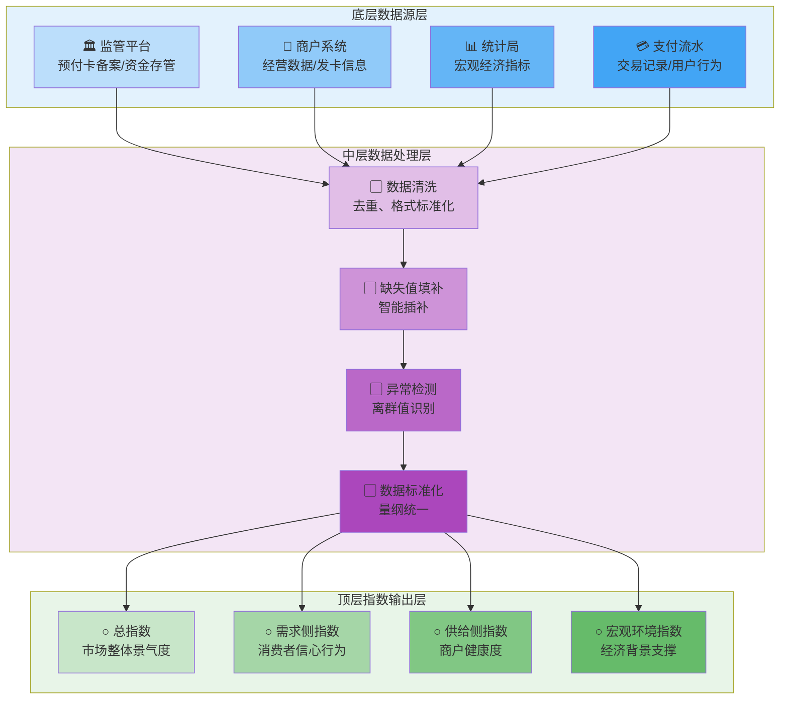

```mermaid
flowchart TD
    subgraph 底层数据源层
        direction TB
        A1[🏛️ 监管平台<br/>预付卡备案/资金存管]
        A2[🏢 商户系统<br/>经营数据/发卡信息] 
        A3[📊 统计局<br/>宏观经济指标]
        A4[💳 支付流水<br/>交易记录/用户行为]
    end

    subgraph 中层数据处理层
        direction TB
        B1[▢ 数据清洗<br/>去重、格式标准化]
        B2[▢ 缺失值填补<br/>智能插补]
        B3[▢ 异常检测<br/>离群值识别]
        B4[▢ 数据标准化<br/>量纲统一]
    end

    subgraph 顶层指数输出层
        direction TB
        C1[○ 总指数<br/>市场整体景气度]
        C2[○ 需求侧指数<br/>消费者信心行为]
        C3[○ 供给侧指数<br/>商户健康度]
        C4[○ 宏观环境指数<br/>经济背景支撑]
    end

    A1 --> B1
    A2 --> B1
    A3 --> B1
    A4 --> B1
    
    B1 --> B2 --> B3 --> B4
    
    B4 --> C1
    B4 --> C2
    B4 --> C3
    B4 --> C4

    style 底层数据源层 fill:#e3f2fd
    style 中层数据处理层 fill:#f3e5f5
    style 顶层指数输出层 fill:#e8f5e8
    style A1 fill:#bbdefb
    style A2 fill:#90caf9
    style A3 fill:#64b5f6
    style A4 fill:#42a5f5
    style B1 fill:#e1bee7
    style B2 fill:#ce93d8
    style B3 fill:#ba68c8
    style B4 fill:#ab47bc
    style C1 fill:#c8e6c9
    style C2 fill:#a5d6a7
    style C3 fill:#81c784
    style C4 fill:#66bb6a
```