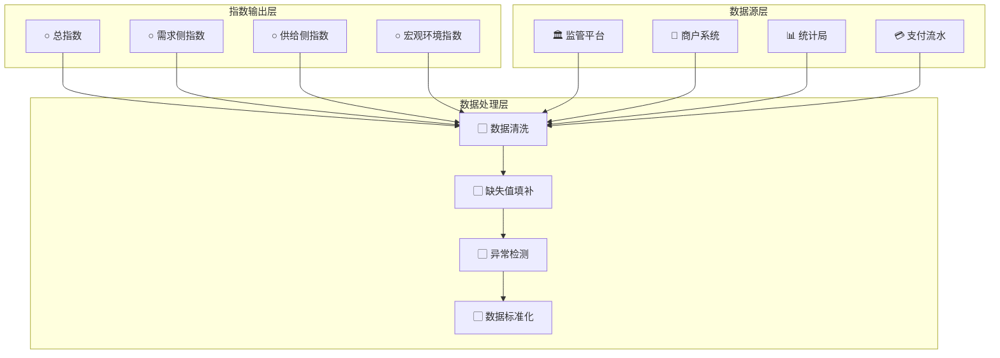

```mermaid
graph TD
    subgraph 顶层 [指数输出层]
        A[○ 总指数]
        B[○ 需求侧指数]
        C[○ 供给侧指数]
        D[○ 宏观环境指数]
    end
    A --> E
    B --> E
    C --> E
    D --> E
    subgraph 中层 [数据处理层]
        E[▢ 数据清洗]
        F[▢ 缺失值填补]
        G[▢ 异常检测]
        H[▢ 数据标准化]
    end
    E --> F
    F --> G
    G --> H
    subgraph 底层 [数据源层]
        I[🏛️ 监管平台]
        J[🏢 商户系统]
        K[📊 统计局]
        L[💳 支付流水]
    end
    I --> E
    J --> E
    K --> E
    L --> E

```